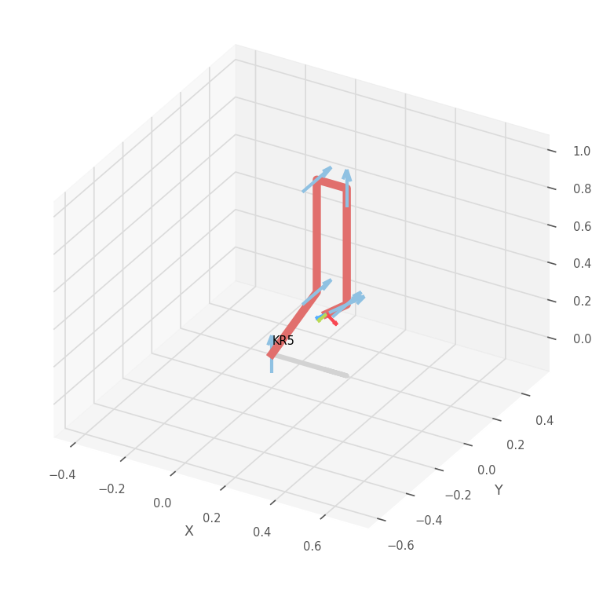
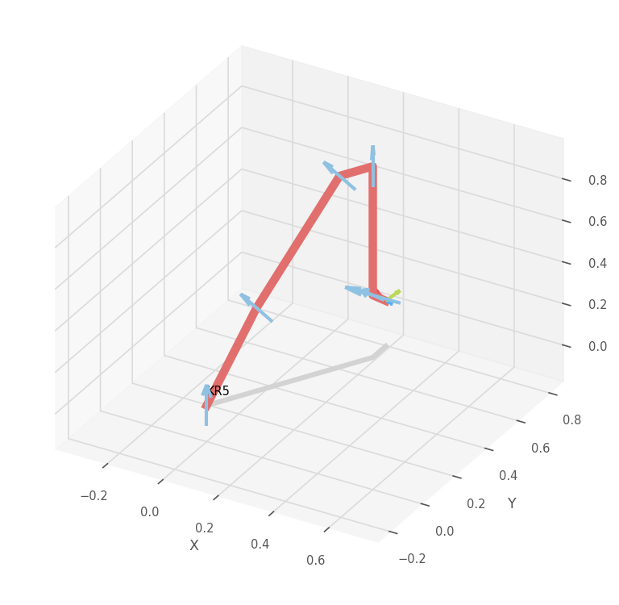
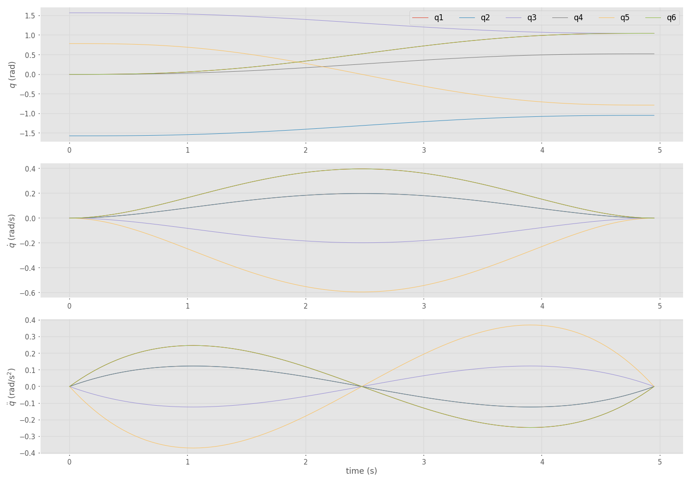
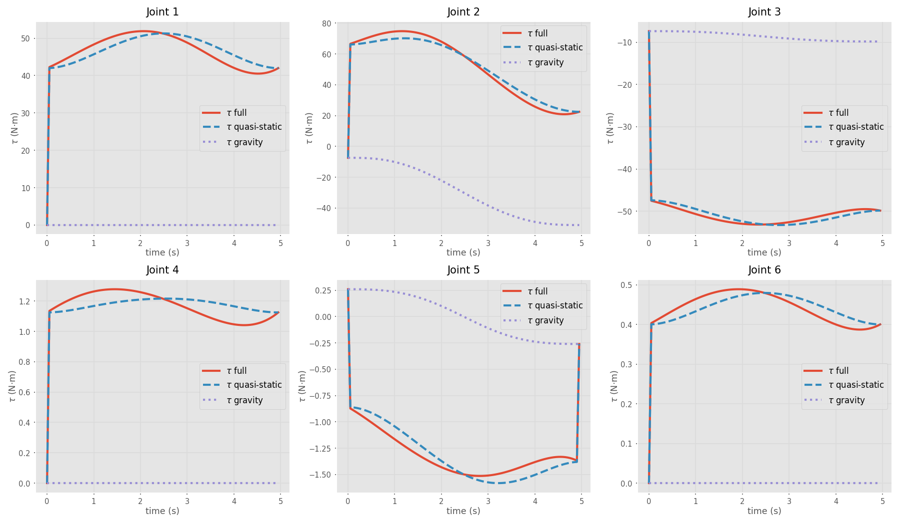

# RMPC — Lab 1
## Dynamic model of a multi-link manipulator

This report addresses the first laboratory work of the *Robot Motion Planning
and Control* course. The Puma560 robot is excluded by the assignment, so the
work is carried out on the **KUKA KR5 sixx** (a 6-DOF industrial manipulator
with all-revolute joints).

The full implementation is contained in [lab1.ipynb](lab1.ipynb). All figures
shown below are also saved under [images/](images/).

---

### 1. Robot model and Denavit–Hartenberg parameters

The model is loaded from `roboticstoolbox.models.DH.KR5()`. Its standard DH
parameters (radians where applicable) are summarised in the table below. They
are produced by `print(robot)` inside the notebook.

| Joint | θⱼ | dⱼ (m) | aⱼ (m) | αⱼ (deg) | qmin (deg) | qmax (deg) |
|------:|----|--------|--------|----------|------------|------------|
| 1 | q₁ | 0.40 | 0.18 | -90 | -155 | 155 |
| 2 | q₂ | 0.00 | 0.60 |   0 | -180 |  65 |
| 3 | q₃ | 0.00 | 0.12 |  90 |  -15 | 158 |
| 4 | q₄ | -0.62 | 0.00 | -90 | -350 | 350 |
| 5 | q₅ | 0.00 | 0.00 |  90 | -130 | 130 |
| 6 | q₆ | -0.115 | 0.00 | 180 | -350 | 350 |

### 2. Dynamic parameters of the KR5

The KR5 model loaded from the toolbox is shipped with empty dynamic
parameters. Each link is therefore filled in manually with values that are
consistent with the size, mass budget (~28 kg total moving mass) and harmonic
drive technology of the real KR5 sixx. The values used in the notebook are:

| Link | m (kg) | r — CoM (m) | I = diag(Ixx, Iyy, Izz) (kg·m²) | Jm (kg·m²) | B (N·m·s/rad) | Tc⁺ / Tc⁻ (N·m) | G |
|------|-------:|-----------------------------|----------------------------------------|-----------:|--------------:|-----------------:|----:|
| 1 | 7.0 | (0.00, -0.05,  0.10) | (0.10,   0.10,   0.05)   | 8.0e-4 | 2.0e-3 |  0.400 / -0.420 | -105 |
| 2 | 9.0 | (-0.30, 0.00,  0.15) | (0.05,   0.50,   0.50)   | 8.0e-4 | 1.8e-3 |  0.350 / -0.360 |  210 |
| 3 | 6.0 | (-0.06, 0.00,  0.06) | (0.04,   0.10,   0.10)   | 5.0e-4 | 1.5e-3 |  0.300 / -0.320 | -125 |
| 4 | 2.0 | (0.00,  0.02, -0.20) | (0.005,  0.005,  0.003)  | 5.0e-5 | 1.0e-4 |  0.015 / -0.018 |   75 |
| 5 | 1.0 | (0.00,  0.00,  0.00) | (0.001,  0.001,  0.0008) | 5.0e-5 | 1.0e-4 |  0.012 / -0.014 |   80 |
| 6 | 0.5 | (0.00,  0.00, -0.04) | (0.0003, 0.0003, 0.0001) | 5.0e-5 | 8.0e-5 |  0.008 / -0.010 |   50 |

The joint limits `qlim` listed in section 1 are kept as provided by the
toolbox.

### 3. Initial and final configurations

The configurations were chosen so that every joint moves and the elbow joint
changes sign during the motion:

* `q_start = [ 0,    -π/2,  π/2,  0,   π/4,  0    ]` rad
* `q_end   = [ π/3,  -π/3,  π/3,  π/6, -π/4,  π/3 ]` rad

| Initial configuration | Final configuration |
|-----------------------|---------------------|
|  |  |

### 4. Trajectory planning

A quintic-polynomial joint-space trajectory is generated with `rtb.jtraj` over
`[0, 5] s` sampled at 100 points. The position, velocity and acceleration
profiles are smooth and start/end at rest, which is the natural input to the
inverse-dynamics study.



### 5. Inverse dynamics — three scenarios

The recursive Newton–Euler routine (`robot.rne`) is used to compute the joint
torques required to produce the trajectory:

\\[
\\boldsymbol\\tau = M(q)\\,\\ddot q + C(q,\\dot q)\\,\\dot q + G(q).
\\]

Three scenarios are evaluated along the same trajectory:

| # | \\(\\dot q\\) | \\(\\ddot q\\) | Physical meaning |
|---|---------------|----------------|------------------|
| 1 | from `tr.qd`  | from `tr.qdd`  | Full dynamics. |
| 2 | from `tr.qd`  | \\(\\approx 0\\)   | Quasi-static motion (negligible accelerations). |
| 3 | 0             | 0              | Holding the configuration against gravity. |

Maximum joint torques observed along the trajectory are:

| Scenario | max ‖τ‖∞ (N·m) |
|----------|----------------|
| Full dynamics    | **74.81** |
| Quasi-static     | 70.17 |
| Gravity hold     | 51.04 |

### 6. Numerical values of M(q), C(q, q̇), G(q)

The matrices are computed at every sample with `robot.inertia`,
`robot.coriolis` and `robot.gravload`. As a consistency check, the
recomposition `M q̈ + C q̇ + G` reproduces the Newton–Euler torques to
machine precision (`max |Δ| < 1 × 10⁻¹⁰` N·m in the notebook).

Values at three representative samples:

**Sample 0 (t = 0.00 s, start of motion):**
```
M(q) =
[[10.59  -0.42  -0.26   0.08   0.00   0.00]
 [-0.42  39.38   0.50  -0.02   0.00   0.00]
 [-0.26   0.50   9.44  -0.26   0.02   0.00]
 [ 0.08  -0.02  -0.26   0.37   0.00   0.00]
 [ 0.00   0.00   0.02   0.00   0.32   0.00]
 [ 0.00   0.00   0.00   0.00   0.00   0.13]]
C(q, q̇) = 0   (since q̇ = 0 at the boundary)
G(q) = [0, -7.39, -7.39, 0, 0.26, 0]  N·m
```

**Sample 50 (t = 2.50 s, midpoint):**
```
M(q) =
[[12.07  -0.41  -0.25   0.13  -0.00   0.00]
 [-0.41  39.78   0.72  -0.02   0.01   0.00]
 [-0.25   0.72   9.49  -0.25   0.03   0.00]
 [ 0.13  -0.02  -0.25   0.37   0.00   0.00]
 [-0.00   0.01   0.03   0.00   0.32   0.00]
 [ 0.00   0.00   0.00   0.00   0.00   0.13]]
C(q, q̇) =
[[ 0.67   0.88  -0.38   0.12  -0.01  -0.00]
 [-0.87   0.19   0.03   0.00   0.01  -0.00]
 [ 0.40   0.18   0.02   0.04  -0.00  -0.00]
 [-0.06  -0.01  -0.03   0.00  -0.00  -0.00]
 [ 0.01   0.00   0.00   0.00  -0.00  -0.00]
 [-0.00  -0.00  -0.00  -0.00   0.00   0.00]]
G(q) = [0, -30.41, -8.69, 0, -0.01, 0]  N·m
```

**Sample 99 (t = 4.95 s, near final pose):**
```
M(q) =
[[14.03  -0.39  -0.21   0.22  -0.01   0.00]
 [-0.39  40.36   1.03  -0.04   0.02   0.00]
 [-0.21   1.03   9.52  -0.21   0.02   0.00]
 [ 0.22  -0.04  -0.21   0.37   0.00   0.00]
 [-0.01   0.02   0.02   0.00   0.32   0.00]
 [ 0.00   0.00   0.00   0.00   0.00   0.13]]
C(q, q̇) ≈ 0   (q̇ → 0 at the boundary)
G(q) = [0, -51.04, -9.84, 0, -0.26, 0]  N·m
```

The full time histories of `M`, `C` and `G` are stored in the file
[images/dyn_matrices.npz](images/dyn_matrices.npz) for offline inspection.

### 7. Joint torques along the trajectory

For every joint the three scenarios are overlaid: the full-dynamics torque
(solid line) is the upper envelope, the quasi-static torque (dashed) reflects
the same motion with the inertial term removed, and the gravity-hold torque
(dotted) shows the static load that the actuator carries even when the joint
is not moving.



### 8. Conclusions

* The recursive Newton–Euler algorithm provided by the toolbox produces the
  same joint torques as the analytical decomposition `M q̈ + C q̇ + G`
  (verified to machine precision), which validates both the dynamic-parameter
  set and the trajectory profile used in the lab.
* For the KR5 mass distribution, joint 2 (shoulder lift) carries by far the
  largest gravity load — its torque exceeds 50 N·m in the final pose just to
  hold position. Joint 3 (elbow) is the second most loaded.
* The full-dynamics torque differs from the quasi-static one mainly in
  joints 2 and 5, where the trajectory features the largest accelerations.
  This shows that the inertial term `M(q) q̈` becomes significant during the
  initial and final transients of the trajectory.
* The Coriolis/centripetal torque, which is the difference between the
  quasi-static and the gravity-hold curves, remains small in this experiment
  (well below 5 N·m). This is consistent with the moderate joint speeds
  produced by the 5-second quintic trajectory.
* Wrist joints 4–6 carry only small loads because they support no payload and
  their moving inertias are an order of magnitude smaller than those of the
  proximal joints.

### Repository layout

```
.
├── README.md              ← this file
├── lab1.ipynb             ← executed notebook with all results
└── images/
    ├── config_start.png
    ├── config_end.png
    ├── trajectory_profiles.png
    ├── torques_three_scenarios.png
    └── dyn_matrices.npz   ← time series of M, C, G
```

### How to reproduce

```bash
pip install roboticstoolbox-python matplotlib numpy
jupyter nbconvert --to notebook --execute lab1.ipynb --output lab1.ipynb
```
